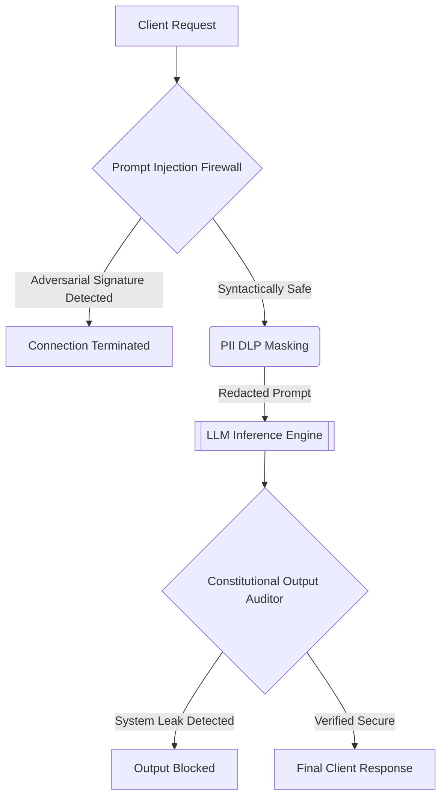

# Enterprise Zero-Trust AI Alignment Proxy

A state-of-the-art framework for securing Large Language Model (LLM) inference endpoints. This architecture transcends traditional API wrapping by instantiating an absolute Zero-Trust paradigm. It enforces Input Alignment via Prompt Injection Firewalls, Data Sovereignty via PII Masking, and Output Security via Constitutional Auditing across a massively scalable High-Performance Computing environment.

## Enterprise Architecture (10-Folder Layout)

To support massive High-Performance Computing proxy workloads, this repository is structured into 10 dedicated domains:
1. `config/`: Configuration files for distributed TLS, RBAC, and Proxy rules.
2. `tests/`: Automated unit and integration testing suite for adversarial payloads.
3. `scripts/`: Shell scripts for Slurm cluster orchestration.
4. `docs/`: Academic whitepapers and generated Sphinx documentation.
5. `models/`: Storage for checkpointed NER and Heuristic detection models.
6. `data/`: Adversarial prompt datasets for continuous red-teaming.
7. `logs/`: Real-time cryptographic audit logs and blocked payload metrics.
8. `notebooks/`: Exploratory Data Analysis (EDA) on prompt injection signatures.
9. `docker/`: Build contexts for containerized Reverse-Proxies.
10. `src/`: The core proprietary zero-trust codebase.

## System Pipeline Architecture



## The 10-Section Alignment Orchestrator (`main.py`)

The primary entrypoint is a massive command-line tool that orchestrates the entire AI Security lifecycle across the 10-folder architecture. Execute the entire pipeline via:
```bash
python src/zero_trust_ai_api/main.py --run_all_enterprise_pipelines
```

**Individual Execution Modules:**
1. `--initiate_zero_trust_cluster`: Initialize the distributed Zero-Trust Proxy.
2. `--launch_prompt_injection_firewall`: Launch the Heuristic Input Defense.
3. `--execute_pii_dlp_masking`: Execute NER-based Data Sovereignty Redaction.
4. `--audit_constitutional_output`: Audit generated inference against IP leakage.
5. `--run_rbac_authorization_checks`: Verify strict JWT identity controls.
6. `--simulate_jailbreak_attack`: Stress-test the perimeter with adversarial prompts.
7. `--compile_security_audit_report`: Aggregate intercepted payload metrics into `logs/`.
8. `--deploy_api_guardrails`: Package deterministic rate limiters and constraints.
9. `--synchronize_cloud_checkpoints`: Sync cryptographic logs securely to an S3 bucket.
10. `--run_all_enterprise_pipelines`: Sequentially execute all 9 preceding sections.

## Alignment Philosophy
Alignment is not merely behavioral tuning; it is cryptographic and deterministic security. By enforcing strict Input-Output boundaries (Firewalls and DLP) within a massive, 10-folder Dockerized ecosystem, this proxy guarantees that the LLM operates within a perfectly secure computational enclave.
