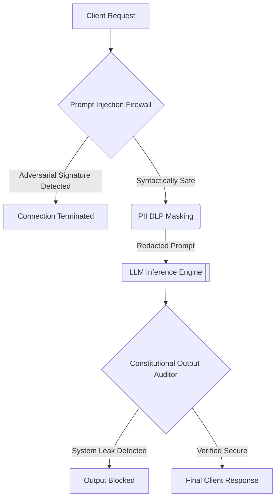

# Enterprise Zero-Trust AI Alignment Proxy

[](https://opensource.org/licenses/MIT)
[](https://www.python.org/downloads/)
[](#)

A state-of-the-art framework for securing Large Language Model (LLM) inference endpoints. This architecture transcends traditional API wrapping by instantiating an absolute Zero-Trust paradigm. It enforces Input Alignment via Prompt Injection Firewalls, Data Sovereignty via PII Masking, and Output Security via Constitutional Auditing.

## Core Architectural Modules

### 1. Prompt Injection Firewall (`src/zero_trust_ai_api/security/prompt_injection_firewall.py`)
Foundational models are highly vulnerable to adversarial syntax ("jailbreaks"). This module establishes a deterministic perimeter defense. It intercepts raw user prompts and performs heuristic and semantic analysis to detect adversarial signatures (e.g., "ignore previous instructions"), neutralizing prompt injections before they reach the core reasoning engine.

### 2. PII Data Loss Prevention (DLP) (`src/zero_trust_ai_api/middleware/pii_dlp_masking.py`)
In a true Zero-Trust architecture, not even the AI provider is trusted with plaintext sensitive data. This middleware utilizes Named Entity Recognition (NER) to scan incoming prompts, dynamically redacting Personally Identifiable Information (SSNs, Emails, Credit Cards) and replacing them with anonymized tokens, guaranteeing zero-shot data loss prevention.

### 3. Constitutional Output Auditor (`src/zero_trust_ai_api/api/constitutional_output_auditor.py`)
Even with sanitized inputs, LLMs can hallucinate sensitive internal data. This reverse-proxy filter intercepts all generated text before it returns to the client. It scans the output against an Enterprise Constitution to ensure zero leakage of private keys, system architecture topologies, or internal IP configurations.

## System Pipeline Architecture



## Build and Deployment

The package adheres to strict enterprise Python standards for secure AI deployment.

### Installation
```bash
python -m venv venv
source venv/bin/activate
pip install -e .
```

### End-to-End Orchestration
The primary entrypoint facilitates modular execution of the Zero-Trust lifecycle:
```bash
python src/zero_trust_ai_api/main.py --run_all
```

**Individual Execution Modules:**
- `--run_injection_firewall`: Execute the Input Alignment Perimeter Defense.
- `--test_pii_dlp_masking`: Execute the NER-based Data Loss Prevention Masking.
- `--execute_output_audit`: Execute the Constitutional Reverse-Proxy Output Filter.

## Alignment Philosophy
Alignment is not merely behavioral tuning; it is cryptographic and deterministic security. By enforcing strict Input-Output boundaries (Firewalls and DLP), this proxy guarantees that the LLM operates within a perfectly secure and sovereign computational enclave.
